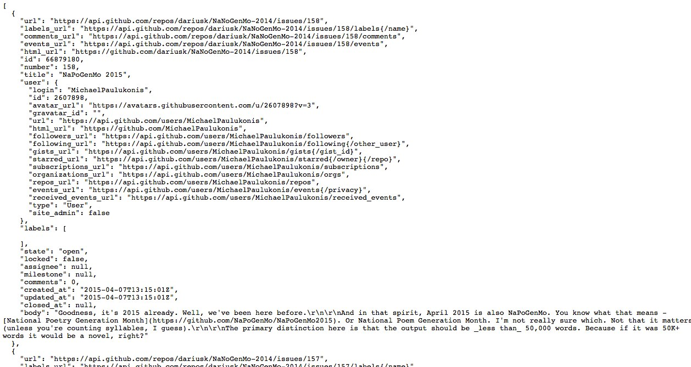

use &harr; to navigate

# API = __A__pplication __P__rogramming __I__nterface
* An __INTERFACE__
* Sits on top of a system 
* Simplifies tasks you might want to perform

# 'Web APIs' are mostly REST API
* URLs are the controls
* __Request__ - you go to a url in your browser
* __Response__ - a web server sends content back   

 __APIs just give you the data__

# 1. Get lots of information quickly

# 2. Get information you can't get in other ways 

# 3. Get real-time information 

# 4. Interface with a service 

# You can get information from APIs without programming in cases 1 and 2
* Find out if the service has an API
* Read through the documentation, eg [Github](https://developer.github.com/v3/)
* URLs = "resources" or "methods"
* Going to a URL = "request" or "call"


* Example: [Github issues for a repo](https://developer.github.com/v3/issues/#list-issues-for-a-repository) 
* ```GET /repos/:owner/:repo/issues```
* https://api.github.com/repos/dariusk/NaNoGenMo-2014/issues

 __Here's the data__

 [json to csv](http://konklone.io/json/)

# Download csv and use the columns you need

# API keys can be a problem
- They stop people abusing the service
- You can apply for API keys
- Include them as a parameter in the url
- eg, https://api.forecast.io/forecast/API-KEY/53.480759,-2.242631

# But it doesn't always work, e.g. Twitter 

# KEY, SECRET, TOKEN, TOKEN_SECRET 


# https://www.getpostman.com/ is a tool to help get around this problem


- Install it as a Chrome extension
- Use it to access APIs 
- Save requests 
- Organise them into collections 

# Popular APIs
 
- [Twitter https://dev.twitter.com/docs/api](https://dev.twitter.com/docs/api)  
- [Flickr http://www.flickr.com/services/api/](http://www.flickr.com/services/api/)  
- [Foursquare https://developer.foursquare.com/](https://developer.foursquare.com/)  
- [Instagram http://instagram.com/developer/](http://instagram.com/developer/)  
- [Facebook https://developers.facebook.com/](https://developers.facebook.com/)  
- [YouTube https://developers.google.com/youtube/](https://developers.google.com/youtube)  


# A long list of REST APIs: http://www.programmableweb.com/apis/directory/1?protocol=REST 


# Combining data and information from different APIs can be powerful


# https://www.freebase.com/ is a database of people, places and things which can help with this process


# Fin. Thanks!  